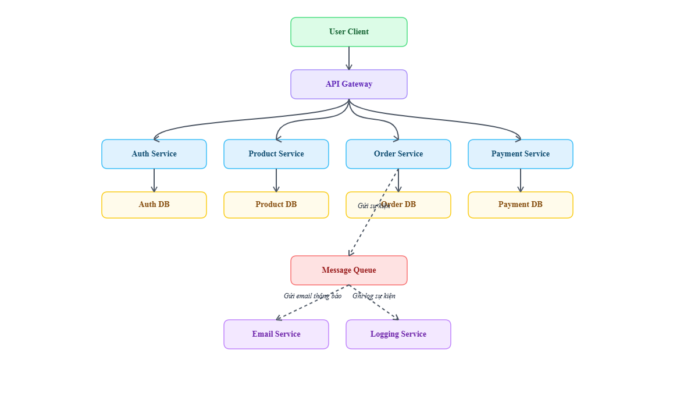
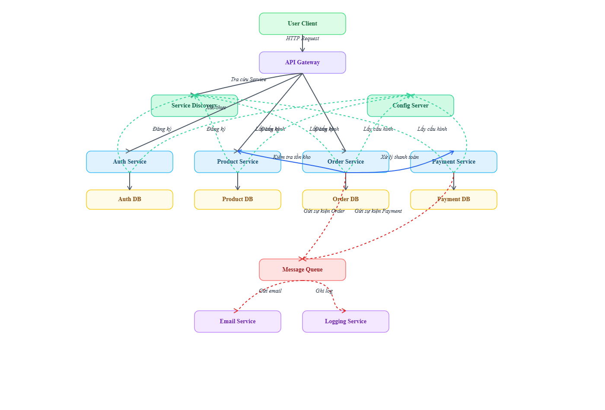
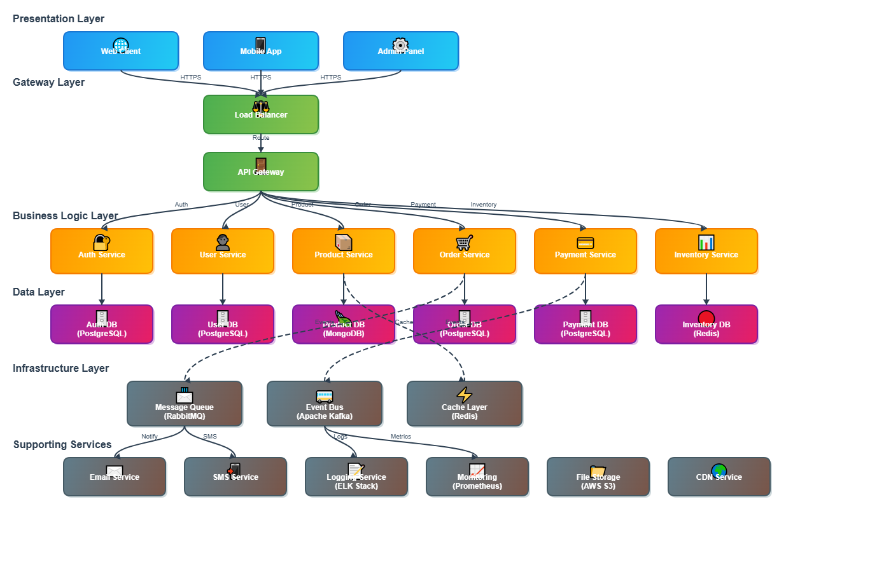
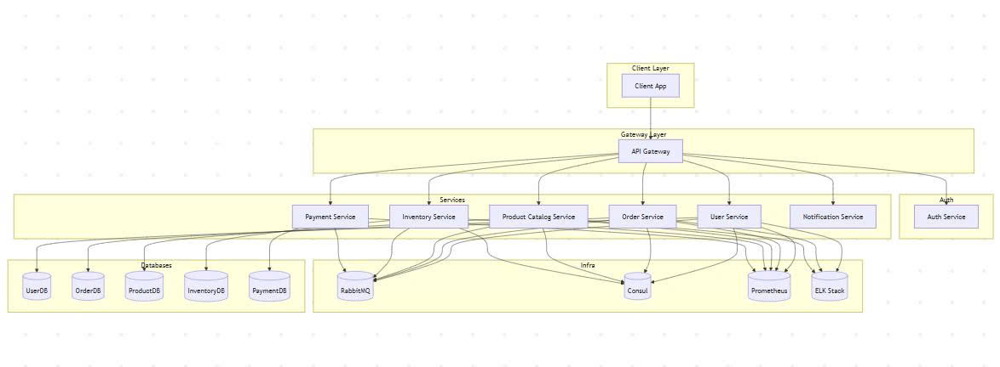
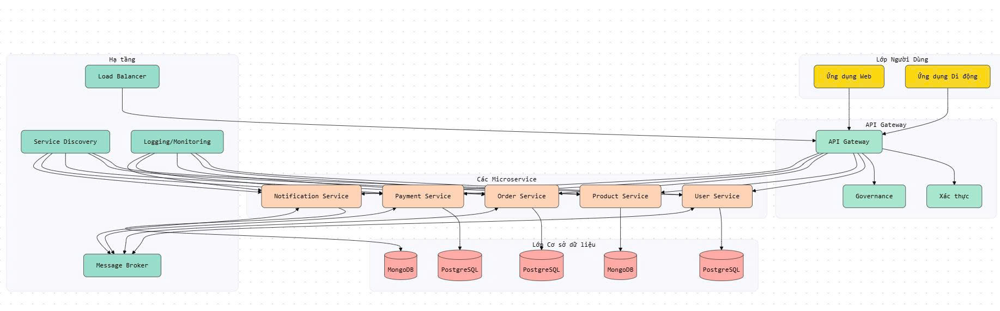
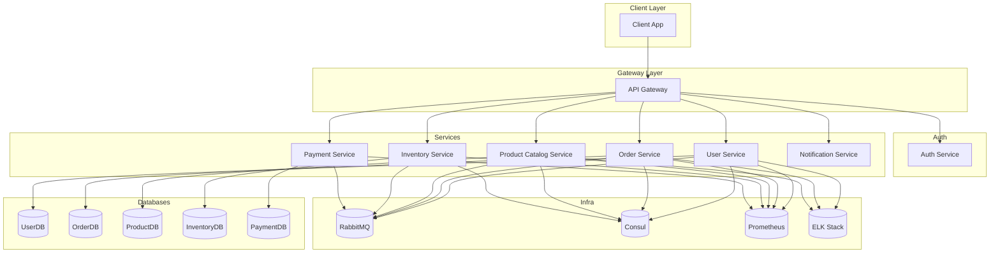

# Microservice System Architecture

This project demonstrates a modern microservice system architecture, designed for scalability, maintainability, and resilience. The system is structured into several independent services, each responsible for a specific business domain, and communicates through well-defined APIs and asynchronous messaging.

## Architecture Overview

The architecture consists of the following main layers:

### 1. Client Layer
- **Web and Mobile Applications**: Serve as the single entry point for users to interact with the system.
- All requests are routed through the API Gateway for unified access and security.

### 2. API Gateway
- **Authentication**: Handles authentication for every client request.
- **Governance**: Implements rate limiting, routing, and monitoring.
- **Load Balancing**: Distributes traffic efficiently across microservices.

### 3. Microservices
- Each microservice is independent and responsible for a specific business function (e.g., Auth, Product, Order, Payment, Notification).
- Services communicate asynchronously using a Message Broker (e.g., RabbitMQ), enabling event-driven workflows.
- **Example**: When an order is created, the Order Service sends an event to the Notification Service via the message queue.

### 4. Database Layer
- Each microservice manages its own database, ensuring data isolation and autonomy.
- **PostgreSQL** is used for transactional data (e.g., orders, payments).
- **MongoDB** is used for unstructured data (e.g., user profiles, notifications).

### 5. Infrastructure
- Includes message brokers (RabbitMQ), service discovery (Consul), monitoring (Prometheus), and logging (ELK Stack).

## System Diagram

Below are visual representations of the system architecture:

### Main Architecture Diagram

### Alternative View

### Professional Diagram

### Mermaid Diagram (JPG)

### AI-Generated Diagram

## Mermaid Syntax Diagram

